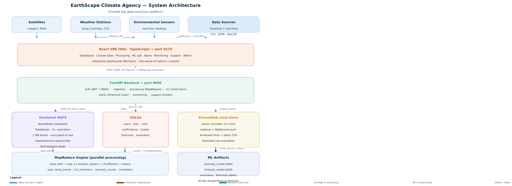

# EarthScape Climate Agency — Climate Big-Data Analytics Platform

End-to-end climate monitoring platform for the **EarthScape Climate Agency**: data ingestion, Hadoop-style distributed storage & batch processing (emulated), real-time streaming, machine learning, alerts, monitoring, and an interactive dashboard.

## Quick start

### 1. Backend (FastAPI, port 8000)
```bash
cd backend
python3 -m venv .venv
.venv/bin/pip install -r requirements.txt
.venv/bin/uvicorn app.main:app --port 8000
```
- API docs: http://localhost:8000/docs
- Demo accounts: `admin/admin123` (admin) · `analyst/analyst123` (analyst)

### 2. Frontend (React + Vite, port 5173)
```bash
cd frontend
npm install
npm run dev        # development
npm run build      # production build
```
Open http://localhost:5173

## Architecture



```
Satellites/weather stations/sensors ──┐
                                      ▼
   Ingestion API ──► Synthetic dataset generator / CSV / JSON upload
                                      ▼
   Emulated HDFS ── 1MB blocks, 2x replication, NameNode metadata, partitions
                                      ▼
   MapReduce engine ── split → parallel map (2 workers) → shuffle/sort → reduce
        ├─ temp_trends       region×year avg/min/max (+ missing handling)
        ├─ co2_emissions     per country & year
        ├─ anomaly_counts    3-sigma statistical anomalies per station
        └─ correlation       temp↔CO2 Pearson r per year
                                      ▼
   Real-time stream ── sensor simulator → StreamHub (pub/sub) → WebSocket /ws/stream
        └─ windowed flush merges into batch storage
                                      ▼
   ML Lab (scikit-learn)
        ├─ IsolationForest anomaly detection (retrainable)
        ├─ seasonal linear regression → 30-day temperature forecast
        └─ CO2 ↔ temperature correlation
                                      ▼
   Alerts engine (threshold rules) → notifications + live WS push
   Monitoring (CPU/RAM/disk/uptime, job runtimes, backups)
   Support (tickets & feedback) · Auth (JWT + roles)
                                      ▼
   React dashboard — 8 pages, live charts, admin RBAC
```

## Feature map (requirements → implementation)

| Requirement | Where |
|---|---|
| Auth + roles (admin/analyst) | `backend/app/auth/` — JWT (HS256), pbkdf2, RBAC, user mgmt |
| Data ingestion (historical + real-time) | `backend/app/ingestion/` — synthetic datasets + CSV/JSON upload |
| HDFS storage | `backend/app/storage/hdfs.py` — blocks, 2x replication, fault-tolerant reads |
| MapReduce processing | `backend/app/processing/` — parallel map/shuffle/reduce + 4 climate jobs |
| Missing-data handling | temp_trends counts missing; ML interpolates/fills |
| Real-time processing | `backend/app/streaming/hub.py` — simulator, pub/sub, WebSocket, windowed flush |
| ML models | `backend/app/ml/models.py` — anomaly, forecast, correlation |
| Visualization | `frontend/` — interactive dashboard (Recharts) |
| Notifications & alerts | `backend/app/alerts/` — threshold rules on live stream |
| Support & feedback | `backend/app/support/` — tickets with admin workflow |
| Performance monitoring | `backend/app/monitoring/` — metrics, job runtimes, uptime |
| Data security | JWT + pbkdf2, encrypted at-rest option via secret, RBAC |
| Reliability | HDFS replication, on-demand + startup backups |
| Scalability | Emulated cluster with configurable workers/splits (`MR_WORKERS`) |
| Documentation | README, `docs/` (user guide, dev docs, video script) |

## Non-functional notes
- **99% uptime target**: uptime tracked in Monitoring; scheduled maintenance = backup + restart
- **Scaling**: `MR_WORKERS` + `REPLICATION` + `BLOCK_SIZE` configurable in `backend/app/config.py`; emulated HDFS can be swapped for real Hadoop by implementing the same `put/read/list/delete` interface
- **This machine is small** (3.6 GB RAM): datasets are kept to ~10k rows, 2 workers — raise limits for full scale

## Tests
```bash
cd backend && .venv/bin/python tests/smoke.py
```

## Project layout
```
backend/app/        auth · storage · ingestion · processing · streaming · ml · alerts · monitoring · support
frontend/src/       api.ts + pages (Dashboard, Data, Processing, ML, Alerts, Monitoring, Support, Admin)
data/               datasets/ · hdfs/ (encrypted blocks + namenode) · models/ · backups/ · keys/
docs/               user guide, developer guide, compliance, video script, demo video, screenshots
```

## Docs
- User guide: `docs/USER_GUIDE.md` · Developer guide: `docs/DEVELOPER_GUIDE.md`
- Compliance & standards: `docs/COMPLIANCE.md`
- Demo video: `docs/demo_video.webm` (page walkthrough; full narration script: `docs/VIDEO_SCRIPT.md`)
- Build log: `PROGRESS.md`
